### 介绍

* 项目名称：操作系统辅助教学系统
* 项目用途：操作系统实验课作业
* 项目描述：使用Java实现操作系统课程中的一些经典算法及其可视化交互
* 作者：L_TiLer

### 基本功能

**文件管理模块**

- 文件打开与保存
- 禁止编辑与允许编辑
- 系统退出

**进程管理模块**

- 进程状态转换：实现进程状态转换过程及其可视化交互，包括进程的阻塞、唤醒与调度
- 生产者-消费者：实现生产者-消费者算法及其可视化交互
- 进程调度：实现进程调度算法及其可视化交互，包括FCFS、时间片调度算法与高相应比调度算法
- 银行家算法：实现银行家算法及其可视化交互

**存储管理模块**

- 动态分区分配算法：实现动态分区分配算法及其可视化交互，包括首次适应算法与最佳适应算法
- 页面置换算法：实现页面置换算法及其可视化交互，包括FIFO置换算法与LRU置换算法

**设备管理模块**

- 磁盘调度算法：实现磁盘调度算法及其可视化交互，包括SSTF调度算法、SCAN调度算法与CSCAN调度算法

### 效果展示

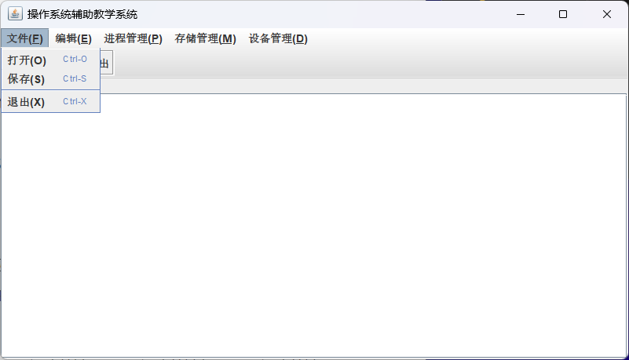

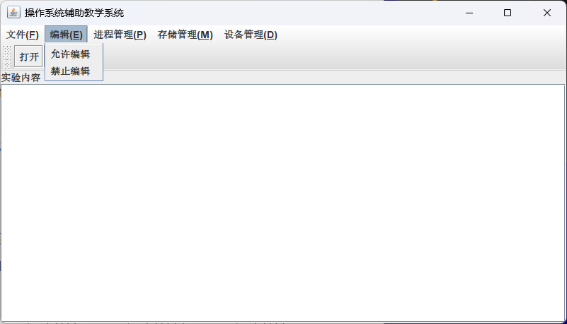

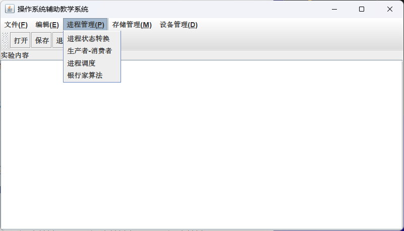

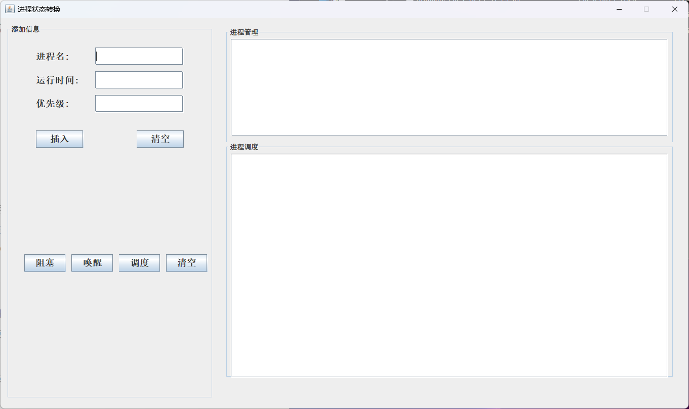

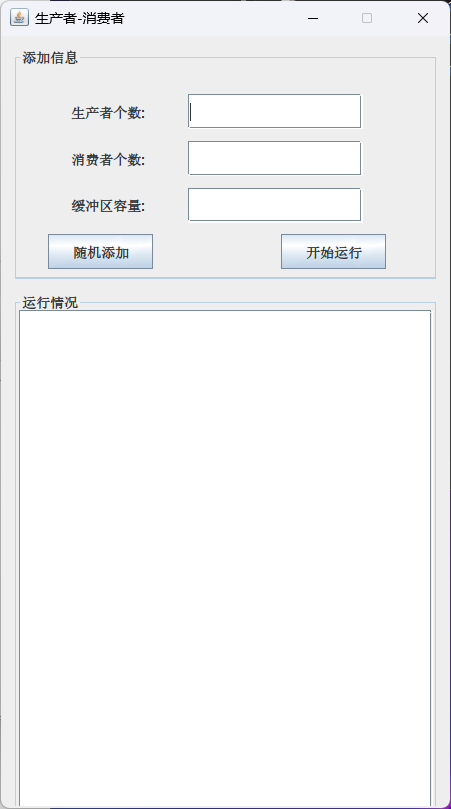

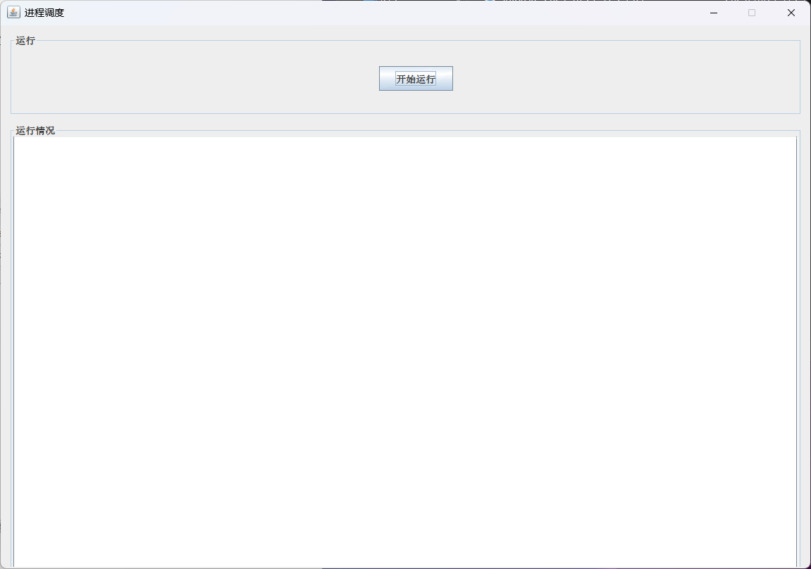

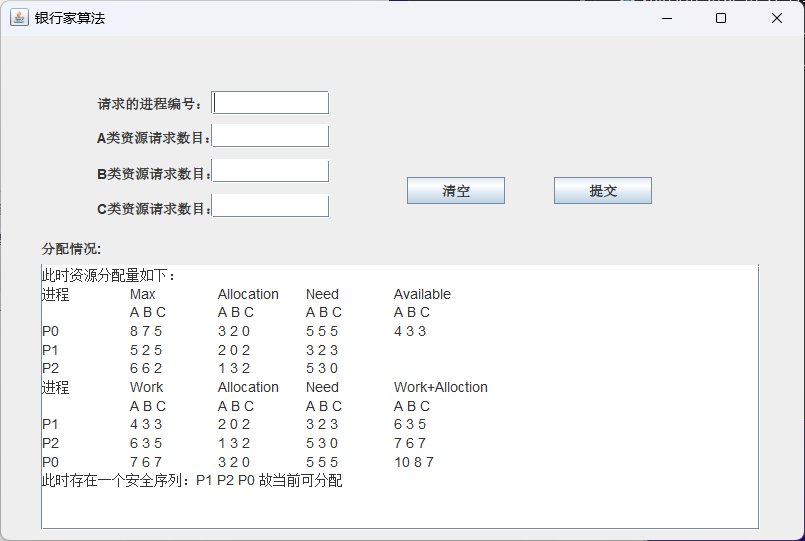

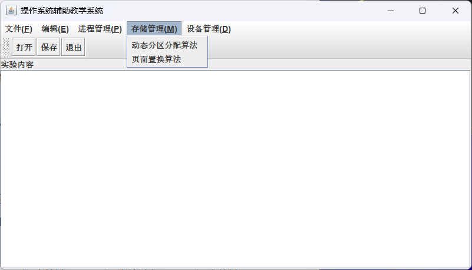

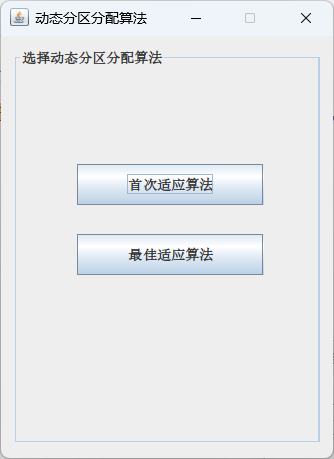

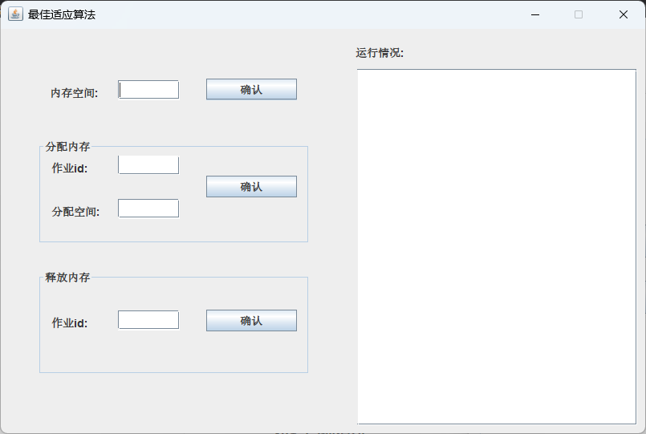

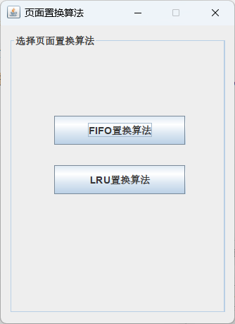

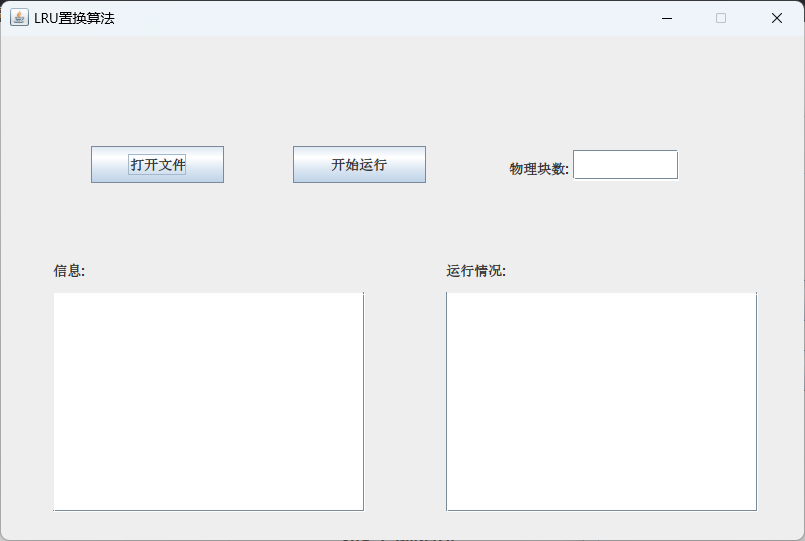

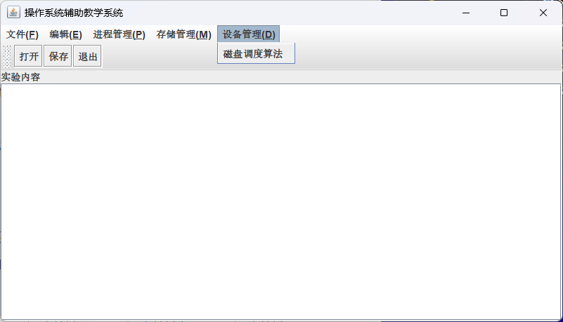

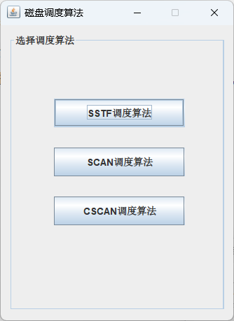

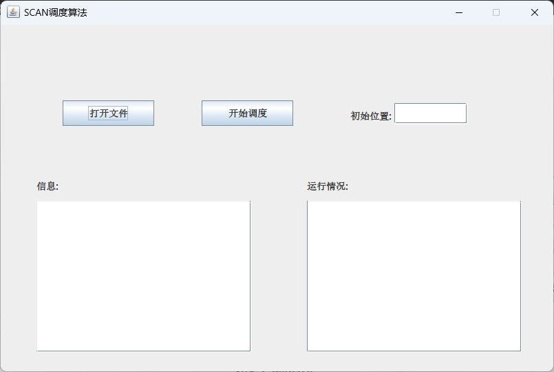

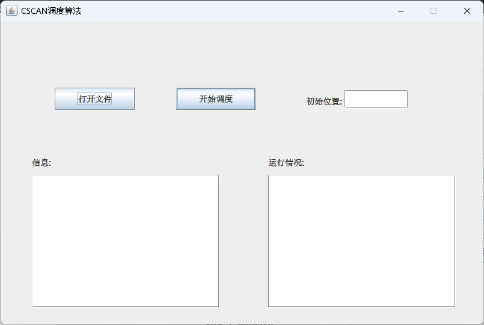